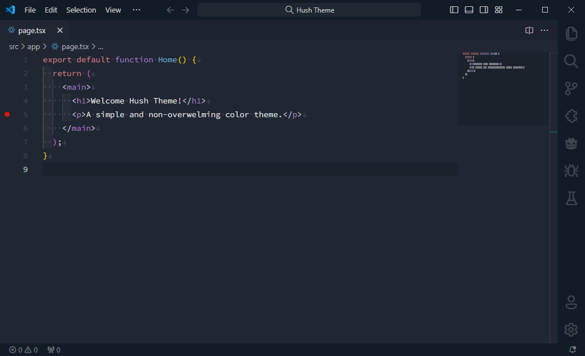

<h3 align="center">Hush for <a href="https://code.visualstudio.com" target="_blank">Visual Studio Code</a></h3>

A color theme for clarity and comfort.

  
  
  
  
  

  

Font family used: **[Source Code Pro](https://fonts.google.com/specimen/Source+Code+Pro)**  
Product icon theme used: **[Fluent Icons](https://marketplace.visualstudio.com/items?itemName=miguelsolorio.fluent-icons)**
